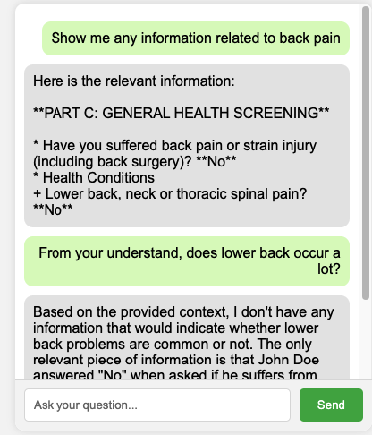

# RAG Model Architecture with LLM (Llama 3.1 from Ollama)

This project implements a Retrieval-Augmented Generation (RAG) system using a large language model (LLM) for handling queries on unstructured data (e.g., PDFs). The system provides context-aware responses with privacy-preserving features, such as PII redaction.

## Overview

The architecture integrates several key components:

1. **Database** (e.g., PDFs)
2. **PII Redaction** using Faker
3. **Context Construction** using RAG
4. **Large Language Model** (LLM) Llama3.1

Each section below provides more details on these components and how they interact.

---

## 1. Database

The system relies on a database containing unstructured documents, such as PDF files. These documents contain the information that the user queries against.

- **Data type:** PDFs or other unstructured data formats.
- **Role:** The source of information that feeds into the system for generating responses.

---

## 2. PII Redaction (Faker)

Before processing any data, the system employs a PII (Personally Identifiable Information) redaction step to ensure that sensitive information is not exposed in the final responses.

- **Tool used:** [Faker](https://faker.readthedocs.io/en/master/) library for redacting PII.
- **Function:** Ensures that the context generated from the database is sanitized by replacing sensitive information with fake or anonymized data.
- **Input:** Context extracted from the database relevant to the query.
- **Output:** PII-redacted context passed on for further processing.

---

## 3. Context Construction (RAG)

The heart of the system is the RAG (Retrieval-Augmented Generation) model, which constructs a context-aware query by retrieving relevant information from the database.

- **Process:**
    - The query is sent to the RAG system, which looks up the relevant context from the PII-redacted database.
    - The context relevant to the query is passed on to the LLM for generating a final response.
- **Input:** Query from the user.
- **Output:** A context-aware query sent to the LLM.

---

## 4. LLM 

The final step in the system involves sending the context-aware query to the LLM (Llama 3.1 from Ollama). The LLM generates a response based on the provided context.

- **Model used:** Llama 3.1 (Ollama).
- **Function:** Processes the context-aware query and generates a natural language response.
- **Prompt template:** Prompt template to interpolate context into the prompt and add any instruction to make the LLM's response more refined.
- **Input:** Context-aware query from the RAG.
- **Output:** Final response delivered to the user.

---

## Workflow

1. **User Query:** A query is made by the user, which initiates the process.
2. **Context Retrieval:** The system retrieves relevant data from the database.
3. **PII Redaction:** Any sensitive information is redacted from the retrieved data.
4. **RAG Model:** The RAG model constructs a context-aware query from the redacted data.
5. **LLM Response:** The LLM processes the query and provides the final response to the user.

---

## Example Flow

1. User asks: "What are the questions involved in general health screening in preemployment health assessment?"
2. The system retrieves the relevant section from the patient's PDF file.
3. PII redaction replaces the patient's name and other sensitive details.
4. The RAG model constructs a query with the anonymised context.
5. The LLM generates a response.

---


## How to run
0. Download [ollama](https://github.com/ollama/ollama). Follow instruction to run llama3.1

1. Install the required packages:
```sh
pip install -r requirements.txt
```

2. Run the Flask API:
```sh
python app.py
```

3. Open [/ui/index.html](ui/index.html) in your web browser to interact with the chatbot.


### Note
The pdf data is autogenerated by chatGPT4o, with sample empty file based on [NSW Preemployment questionnaire](https://www.nnswlhd.health.nsw.gov.au/sites/default/files/inline-files/NNSW-LHN-Pre-Employment-Health-Questionnaire.pdf).

